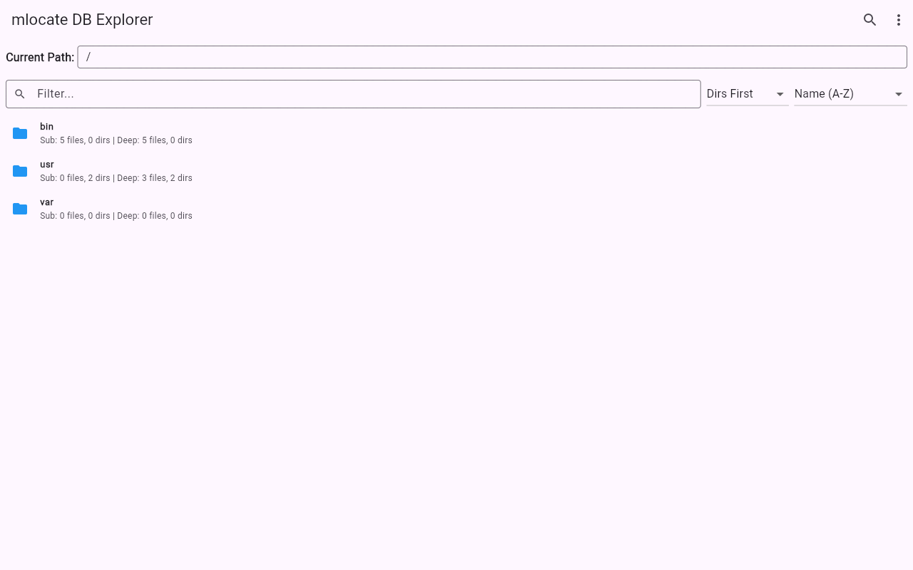
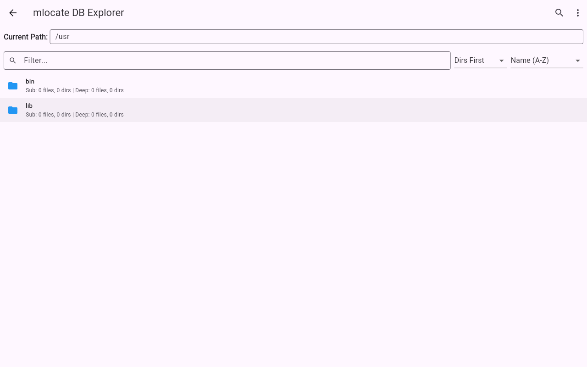
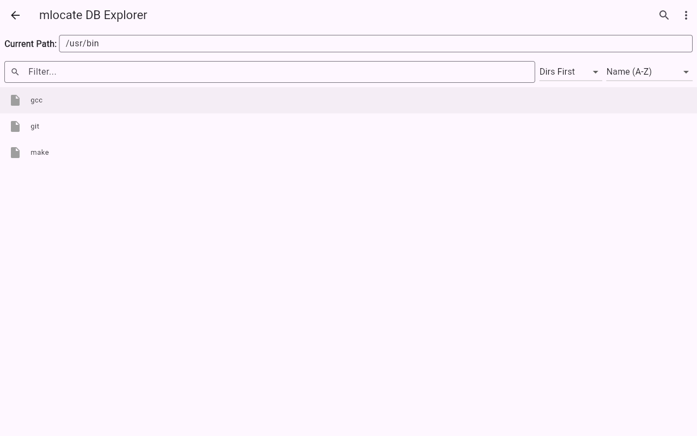
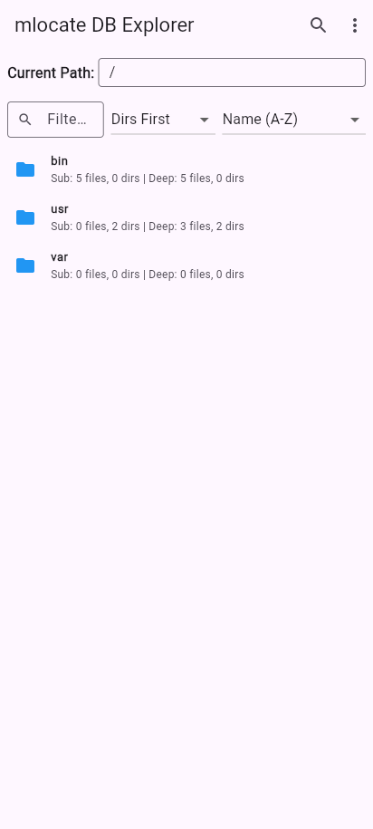
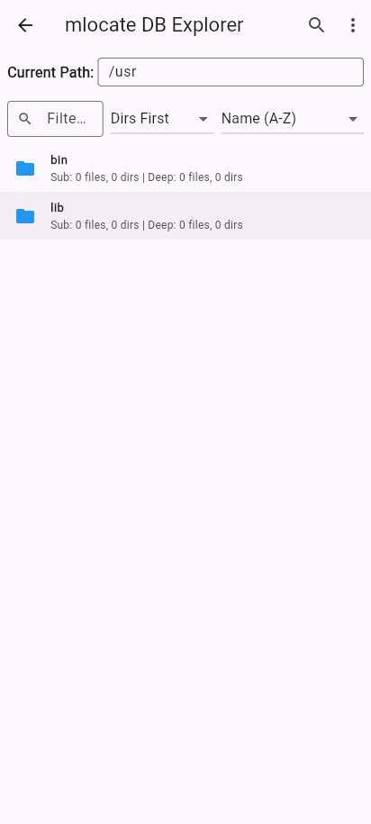

# 
mlocate Explorer

  <strong>A cross-platform graphical user interface (GUI) designed to parse and explore `mlocate.db` files.</strong>

 

  

 

## 🚀 Overview

**mlocate Explorer** is a high-performance Flutter application built for system administrators, developers, and power users who need to analyze and search through `mlocate` databases efficiently.

The `mlocate.db` file is typically used by the `locate` command-line utility on Unix-like systems to quickly find files. This application reads the raw binary format directly, allowing you to visually browse the filesystem snapshot, perform instant global searches, and analyze directory compositions—all without needing command-line tools.

## ✨ Features

*   **⚡ Native Binary Parsing:** The core `MlocateDBParser` interprets the `mlocate.db` binary format directly, verifying magic numbers and decoding raw filesystem bytes (including full support for malformed UTF-8/legacy encodings).
*   **🗂️ Intuitive File Browser:** Navigate the parsed database as a hierarchical tree. View detailed file and folder counts (both shallow and deep) for any directory instantly.
*   **🔍 High-Speed Locate Mode:** Perform global searches across the entire database. The app uses an optimized, non-blocking queue-based DFS to ensure the UI remains buttery smooth even with massive databases.
*   **📱 Cross-Platform & Responsive:** Built with Flutter, it works seamlessly as a Desktop application (Linux/macOS/Windows) and scales perfectly to mobile viewports.
*   **🐞 Detailed Error Diagnostics:** Built-in error reporting with hex dumps to help diagnose corrupted or incompatible database files.
*   **🔀 Advanced Sorting & Filtering:** Group directories first, sort by name or modification time, or instantly filter the current view using the fast local search.
*   **📤 Export Capabilities:** Export directory listings or full directory trees directly to text files for external analysis.

## 📸 Screenshots

  

    

      <h4>Exploring Directories</h4>
      
    

    

      <h4>Filtering Files</h4>
      
    

  

### Mobile Experience
The application is fully responsive and supports mobile viewports perfectly.

  

    
    
    
  

---

## 📥 Installation

Pre-compiled binaries will be automatically uploaded to **GitHub Releases** for each platform.

1. Navigate to the [Releases page](../../releases).
2. Download the appropriate bundle for your operating system.
3. Extract and run the executable.

*(To build from source, ensure you have Flutter installed and run `flutter run` or `flutter build <platform>` from the repository root).*

## 🛠️ Architecture Notes

*   **Asynchronous Parsing:** Uses Dart Isolates to offload the heavy lifting of reading and interpreting the binary database, preventing any UI stutter.
*   **Smart Rendering:** Utilizes Flutter's standard `ListView.builder` for highly efficient, lazy-rendered dynamic lists.
*   **State Management:** Decouples navigation state (`_navigationStack`) from view state, paired with robust scroll memory to retain your exact position when navigating back and forth through deep directory trees.
